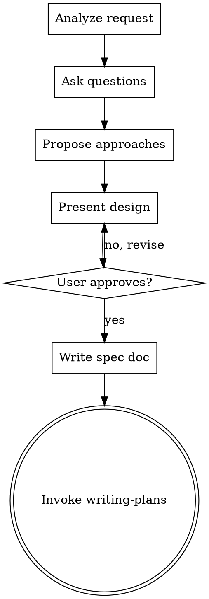

# Supercoder Brainstorming

Turn ideas into fully formed designs and specs through collaborative dialogue.

## The Rule

**DO NOT write any code, scaffold any project, or take any implementation action until you have presented a design and the user has approved it.**

## Workflow

## Checklist

1. **Analyze the request** - Break down what user wants
2. **Ask clarifying questions** - One at a time, understand scope
3. **Propose 2-3 approaches** - With trade-offs and recommendation
4. **Present design** - Scale to complexity, get approval
5. **Write design doc** - Save to `docs/superpowers/specs/YYYY-MM-DD-<topic>-design.md`
6. **Get user review** - Ask user to review spec before proceeding
7. **Invoke writing-plans** - Transition to implementation

## Key Principles

- **One question at a time** - Don't overwhelm
- **Multiple choice preferred** - Easier for user
- **YAGNI ruthlessly** - Remove unnecessary features
- **Explore alternatives** - Always propose options
- **Incremental validation** - Get approval before moving on

## After Design Approved

- Write spec to `docs/superpowers/specs/YYYY-MM-DD-<topic>-design.md`
- Commit to git
- Ask user to review
- Only proceed once approved
- Then invoke `writing-plans` skill

## Anti-Patterns

- "This is too simple to need a design" - EVERY project needs design
- "Let me just write some code first" - VIOLATION - design first
- Skipping questions - Understand before implementing
