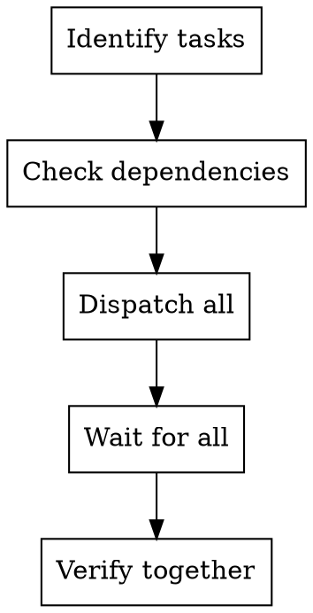

# Supercoder Dispatching Parallel Agents

## When To Use

When you have 2+ tasks that:
- Can work independently
- Don't share state
- No sequential dependencies
- Can be done concurrently

## Examples

- "Fix bugs in file A and file B" (independent)
- "Add tests for module X and module Y" (parallel)
- "Refactor service A and service B" (concurrent)

## Workflow

## Checklist

### 1. Identify Tasks

- List all tasks
- Verify each can be done independently

### 2. Check Dependencies

Ask for each task:
- Does it depend on another task's output?
- Does it share state with another task?
- Can it run concurrently?

### 3. Dispatch

- Dispatch all independent tasks
- Each gets clear scope
- Each has verification criteria

### 4. Wait

- Wait for all to complete
- Don't proceed until all done

### 5. Verify

- Run full test suite
- Verify integration
- Check for conflicts

## When NOT to Use

- Tasks depend on each other
- Shared state required
- Sequential execution needed
- One task feeds into another

## Anti-Patterns

- Forcing parallel when sequential needed - WRONG
- Not checking dependencies - WRONG
- Proceeding before all complete - WRONG
- Not verifying integration - WRONG
