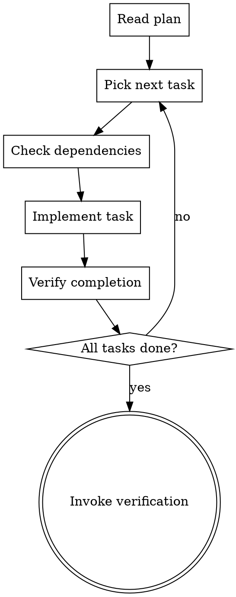

# Supercoder Executing Plans

Execute implementation plans task-by-task with verification at each checkpoint.

## When To Use

After `writing-plans` skill has created the implementation plan.

## Workflow



## Checklist

### Per Task

1. **Check dependencies** - Are prerequisites complete?
2. **Read relevant files** - Understand existing code
3. **Implement changes** - Write code/tests
4. **Run verification** - Does it work?
5. **Move to next task** - Repeat

### Overall

- [ ] All tasks implemented
- [ ] All tests pass
- [ ] No regressions
- [ ] Lint passes
- [ ] Documentation updated

## Task Execution

### Step 1: Read the Plan
- Read full implementation plan
- Understand scope
- Check dependencies

### Step 2: Pick Next Task
- Start with tasks that have no pending dependencies
- Mark tasks as in-progress

### Step 3: Check Dependencies
- Are all prerequisites complete?
- If not, skip to another task

### Step 4: Implement
- Read existing code
- Make changes
- Write tests

### Step 5: Verify
- Run tests
- Check for errors
- Verify behavior

### Step 6: Repeat
- Next task
- Continue until all done

## Progress Tracking

Track progress using TodoWrite:
```
- [ ] Task 1: Create User Model
- [ ] Task 2: Add User Repository
- [ ] Task 3: Create Auth Service
```

## After All Tasks Complete

Invoke `verification-before-completion` skill to do final verification.

## Anti-Patterns

- Skipping tasks - WRONG - do all tasks
- Ignoring dependencies - WRONG - check first
- Not verifying - WRONG - always verify
- Moving on without tests - WRONG - tests required
