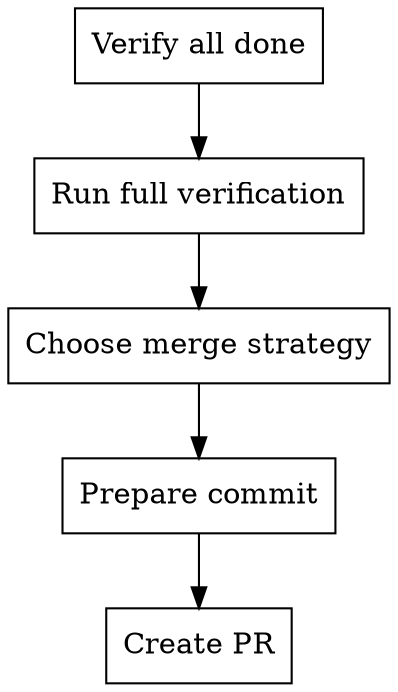

# Supercoder Finishing a Development Branch

## When To Use

When:
- Implementation complete
- All tests pass
- Ready to integrate work

## Workflow



## Checklist

### 1. Verify All Done

- [ ] All tasks complete
- [ ] All tests pass
- [ ] No pending feedback
- [ ] Documentation updated

### 2. Run Full Verification

```bash
# Tests
npm test

# Lint
npm run lint

# Types
npm run typecheck

# Build
npm run build
```

### 3. Choose Merge Strategy

| Option | When to Use |
|--------|-------------|
| Squash & Merge | Single logical change |
| Rebase & Merge | Linear history preferred |
| Merge Commit | Multiple logical commits |

### 4. Prepare Commit

- Review changes with `git diff`
- Clear commit message
- Link related issues

### 5. Create PR

- Clear title
- Detailed description
- Steps to test
- Related issues

## Merge Options

### Squash & Merge
Combine all commits into one. Use when:
- Many small fixes
- Single feature
- Clean history wanted

### Rebase & Merge
Apply commits on top of target. Use when:
- Linear history wanted
- Small, atomic commits
- Keep feature branch clean

### Merge Commit
Create merge commit. Use when:
- Multiple logical commits
- Want to preserve history
- Team prefers this

## Anti-Patterns

- Not running full verification - WRONG
- Skipping tests - WRONG
- Poor commit message - WRONG
- Not linking issues - WRONG

## Next Steps

After finishing branch:
1. Create PR
2. Request review
3. Address feedback
4. Merge when approved
