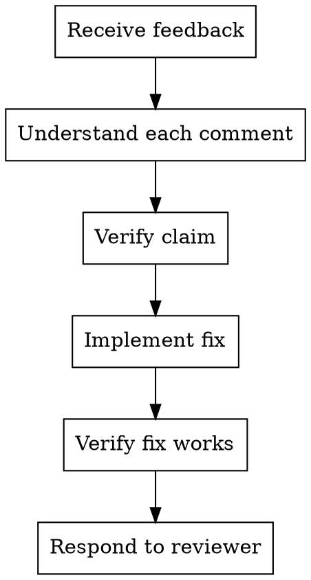

# Supercoder Receiving Code Review

## When To Use

When you receive feedback on your code changes:
- PR comments
- Review suggestions
- Change requests
- Feedback from reviewer

## The Rule

**DO NOT implement suggestions blindly. Understand, verify, then implement.**

## Workflow

## Checklist

### 1. Understand Each Comment

- Read all comments carefully
- Don't assume - clarify if unclear
- Note severity: required vs optional

### 2. Verify Each Claim

**For every comment:**
1. Read the code in question
2. Understand the context
3. Verify if the comment is accurate
4. Check if it's a real issue or preference

### 3. Categorize Feedback

| Type | Action |
|------|--------|
| Bug/Error | Fix - this is a real issue |
| Style | Fix - follow project conventions |
| Suggestion | Consider - may improve code |
| Question | Respond - explain your reasoning |
| Preference | Discuss - may not be right for this case |

### 4. Implement Fixes

For each fix:
- Make the change
- Run tests
- Verify it addresses the comment

### 5. Respond

For each comment, respond:
- What you changed (or why you didn't)
- How you verified it

## Response Templates

### Fixed:
> Fixed. Changed X to Y. Tests pass.

### Clarification:
> Good point. I did it this way because [reason]. Let me know if you'd like me to change it.

### Alternative:
> I considered that but chose this approach because [trade-off]. Would you like me to try your suggestion?

### Won't Fix:
> I looked at this but decided not to change because [reason].

## Anti-Patterns

- Implementing without understanding - WRONG
- Ignoring feedback - WRONG
- Taking all suggestions blindly - WRONG
- Not verifying fixes - WRONG
- Not responding to comments - WRONG

## Verification

After implementing fixes:
- Run tests
- Run lint
- Run typecheck
- Ensure no regressions
