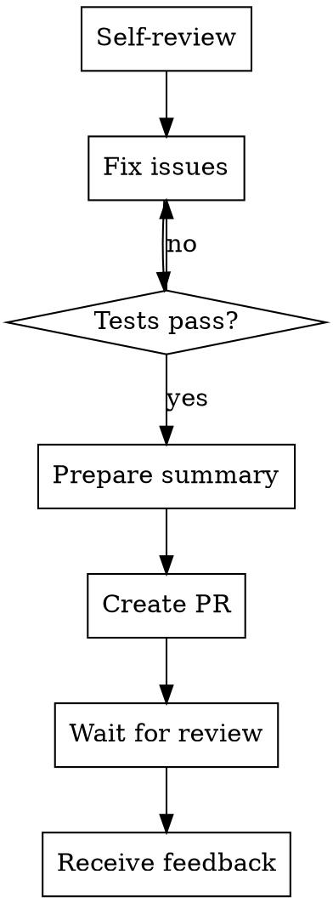

# Supercoder Requesting Code Review

## When To Use

Before:
- Creating a PR
- Merging to main
- Requesting review
- Marking work complete

## Checklist

### 1. Self-Review First

Before requesting others review:
- [ ] All tests pass
- [ ] Lint passes
- [ ] Types check
- [ ] Build succeeds
- [ ] No console.log/debug code
- [ ] No secrets in code
- [ ] Comments updated

### 2. Prepare Summary

Write a clear summary:
- What changed
- Why it changed
- How to test

### 3. Review Your Own Changes

```bash
git diff main..HEAD
```

- Check each changed file
- Verify changes are correct
- Remove debug code

### 4. Create PR/Request

Include:
- Title: Clear description
- Body: What, Why, How to test
- Screenshots (if UI)
- Related issues

## PR Template

```markdown
## Summary
Brief description of changes.

## Changes
- File 1: What changed
- File 2: What changed

## Testing
How to test these changes.

## Checklist
- [ ] Tests pass
- [ ] Lint passes
- [ ] Manual testing done
```

## The Review Flow



## Anti-Patterns

- Requesting review without self-review - WRONG
- Leaving failing tests - WRONG
- Not testing manually - WRONG
- Unclear PR description - WRONG
- Not responding to feedback - WRONG

## After Review Received

Use `receiving-code-review` skill to handle feedback.

## Verification Before Request

Run these commands:
```bash
# Tests
npm test

# Lint
npm run lint

# Types
npm run typecheck

# Build
npm run build
```

All must pass before requesting review.
