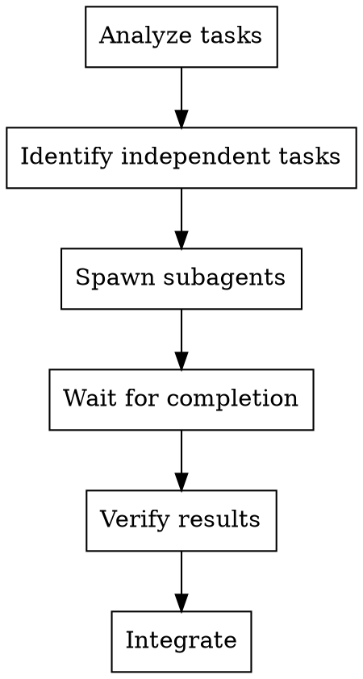

# Supercoder Subagent-Driven Development

## When To Use

When you have multiple independent tasks that can be worked on in parallel:
- Multiple files to modify
- Independent features
- Large refactoring
- Multiple similar tasks

## Workflow



## Checklist

### 1. Analyze Tasks

- List all tasks
- Identify dependencies between tasks
- Group independent tasks

### 2. Identify Independent Tasks

- Tasks that don't depend on each other
- Can be done in parallel
- Each agent owns specific files

### 3. Spawn Subagents

For each independent task:
- Spawn a subagent
- Give clear instructions
- Specify files to own
- Set verification requirements

### 4. Coordinate

- Track all subagents
- Wait for completion
- Handle dependencies between agents

### 5. Integrate Results

- Combine all changes
- Verify everything works together
- Handle conflicts

## Subagent Template

```
Implement Task X from <plan-doc>

Files in scope: file1.ts, file2.ts

Requirements:
1. [Specific requirement]
2. [Specific requirement]

Verification:
- Run tests
- Verify behavior
- Report changed files
```

## Anti-Patterns

- Spawning too many agents at once - WRONG
- Not defining clear boundaries - WRONG
- Missing verification step - WRONG
- Not waiting for completion - WRONG

## Key Principles

- **Clear boundaries** - Each agent knows their files
- **Independent first** - Parallelize what you can
- **Verify results** - Check each agent's work
- **Integrate** - Combine and test together
