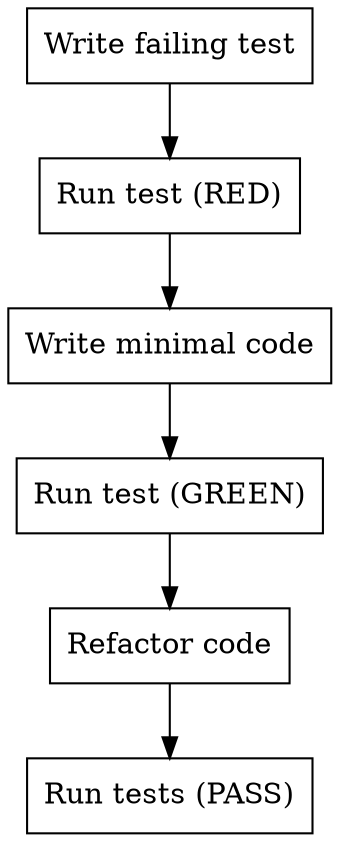

# Supercoder Test-Driven Development

## The TDD Cycle

```
RED → GREEN → REFACTOR
```

1. **RED** - Write a failing test first
2. **GREEN** - Write minimal code to pass the test
3. **REFACTOR** - Improve code while keeping tests passing

## When To Use

For ALL code implementation:
- New features
- Bug fixes
- Refactoring
- New functions
- New components

## Workflow



## Checklist

### 1. Write Failing Test (RED)

- Write test BEFORE writing implementation
- Test describes expected behavior
- Run test → should FAIL
- This is the "RED" phase

### 2. Write Minimal Code (GREEN)

- Write only what's needed to pass test
- Don't over-engineer
- Run test → should PASS
- This is the "GREEN" phase

### 3. Refactor (REFACTOR)

- Improve code quality
- Keep tests passing
- No new features - just clean code
- This is the "REFACTOR" phase

### 4. Repeat

- Next piece of functionality
- Back to step 1

## Test Structure

```typescript
describe('FeatureName', () => {
  it('should do something specific', () => {
    // Arrange - set up test data
    // Act - call function
    // Assert - check result
  });
});
```

## Principles

- **Test first** - Always write test before code
- **One at a time** - Focus on one test/feature
- **Minimal code** - Only pass the test
- **Refactor after** - Clean up after tests pass
- **Keep tests passing** - Never commit broken tests

## Anti-Patterns

- Writing code first, then tests - WRONG
- Writing too many tests at once - WRONG
- Skipping tests because "it works" - WRONG
- Leaving tests failing - WRONG

## Verification

- All tests pass
- Code coverage maintained or improved
- No regressions
- Lint passes
