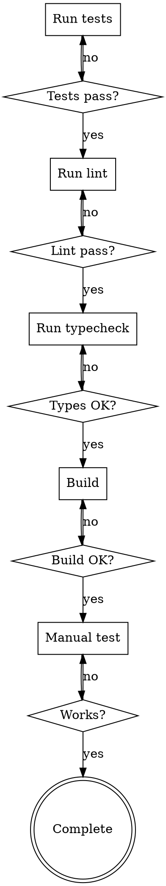

# Supercoder Verification Before Completion

## The Rule

**NEVER claim work is complete without running verification.**

> Evidence before assertions.

## When To Use

Before:
- Committing changes
- Creating PR
- Merging
- Telling user "done"

## Checklist

### 1. Run Tests

```bash
# Run all tests
npm test
# or
cargo test
# or
pytest
```

- [ ] All tests pass
- [ ] No skipped tests (unless intentional)
- [ ] Coverage maintained

### 2. Run Lint

```bash
# ESLint, Rustfmt, etc.
npm run lint
# or
cargo fmt
cargo clippy
```

- [ ] No lint errors
- [ ] No warnings (or accepted)

### 3. Run Typecheck

```bash
# TypeScript, etc.
npm run typecheck
# or
tsc --noEmit
```

- [ ] No type errors
- [ ] No strict mode violations

### 4. Build Check

```bash
# Build the project
npm run build
# or
cargo build
```

- [ ] Build succeeds
- [ ] No build warnings

### 5. Manual Verification

- [ ] Feature works as expected
- [ ] Edge cases handled
- [ ] Error handling works

### 6. Review Changes

```bash
git diff
git status
```

- [ ] All expected changes
- [ ] No unexpected changes
- [ ] No secrets committed

## Verification Commands by Language

| Language | Test | Lint | Typecheck |
|----------|------|------|-----------|
| TypeScript | npm test | eslint | tsc --noEmit |
| Python | pytest | ruff | mypy |
| Rust | cargo test | cargo fmt | cargo clippy |
| Go | go test | go fmt | go vet |

## The Verification Flow



## Anti-Patterns

- "Tests pass, I'm done" - WRONG - run all verifications
- "It builds locally" - WRONG - verify all steps
- "I tested manually" - WRONG - also run automated tests
- Skipping lint/typecheck - WRONG - always run
- Not checking for regressions - WRONG - verify nothing broke

## Important

**Evidence before assertions.**

Don't say "it's done" until you've run verification commands and confirmed the output.

## Output

After verification complete:
- Summary of what was verified
- Any issues found
- Ready to commit/PR
