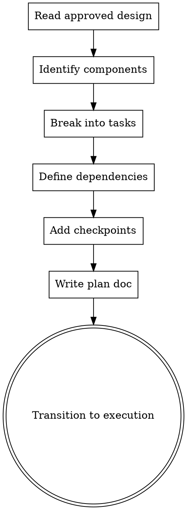

# Supercoder Writing Plans

Create detailed implementation plans from approved designs.

## When To Use

After `brainstorming` skill completes and user has approved the design.

## Workflow



## Checklist

1. **Read approved design** - Understand all sections
2. **Identify components** - List all modules/components
3. **Break into tasks** - Each task should be 1-4 hours max
4. **Define dependencies** - What must happen first
5. **Add checkpoints** - Verification points after each task
6. **Write plan doc** - Save to `docs/superpowers/plans/YYYY-MM-DD-<topic>.md`
7. **Transition to execution** - Use `executing-plans` skill

## Task Structure

Each task should have:
- **Title** - Clear description
- **Files** - Files to modify
- **Steps** - Numbered steps to complete
- **Verification** - How to verify completion
- **Dependencies** - What must complete first

## Example Task

```markdown
### Task 1: Create User Model

**Files:**
- `server/src/models/user.model.ts`
- `server/src/database/migrations/001_create_users.sql`

**Steps:**
1. Define User interface with TypeScript
2. Create Sequelize model
3. Add indexes for email, tenantId

**Verification:**
- Run `tsc --noEmit` - no errors
- Migration runs successfully
```

## Output

Save to: `docs/superpowers/plans/YYYY-MM-DD-<topic>.md`

## Next Step

After plan is written, invoke `executing-plans` skill to implement tasks.
